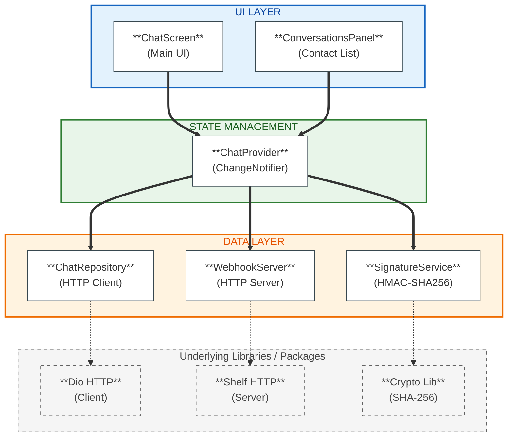
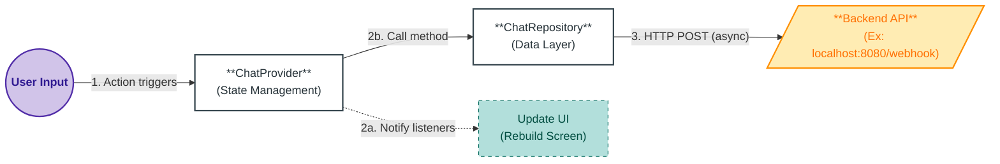
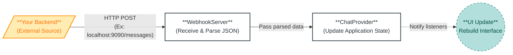
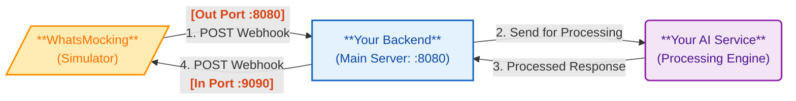

# WhatsMocking

<div align="center">

[](https://flutter.dev)
[](https://dart.dev)
[](LICENSE)
[]()

**A professional WhatsApp-like mockup application for testing webhooks in your local development environment**

[Features](#features) • [Architecture](#architecture) • [Getting Started](#getting-started) • [Documentation](#documentation) • [Testing](#testing)

</div>

---

## Table of Contents

- [Introduction](#introduction)
- [Features](#features)
- [Architecture](#architecture)
- [Technologies](#technologies)
- [Getting Started](#getting-started)
- [Configuration](#configuration)
- [Usage](#usage)
- [Webhook Integration](#webhook-integration)
- [Testing](#testing)
- [Project Structure](#project-structure)
- [Contributing](#contributing)
- [License](#license)
- [Support](#support)

---

## Introduction

**WhatsMocking** is a Flutter-based desktop application that simulates WhatsApp's chat interface, specifically designed for developers who need to test webhook integrations locally. It provides a realistic environment to develop and debug webhook-based applications without requiring external services or cloud deployments.

### Purpose

Modern webhook development often requires:
- **Bidirectional communication** between client and server
- **HMAC signature validation** for security
- **Interactive message types** (buttons, lists)
- **Multi-contact management** to simulate different users
- **Local testing environment** without cloud dependencies

WhatsMocking addresses all these needs with a production-grade mockup that follows WhatsApp Business API standards.

### Use Cases

- **Backend API Development**: Test your webhook endpoints without deploying to production
- **WhatsApp Business API Integration**: Develop bots locally with full interactive message support
- **Educational Projects**: Learn webhook architecture and API integration patterns
- **Portfolio Demonstrations**: Showcase webhook-based applications with professional UI

---

## Features

### Core Functionality
- **WhatsApp-style Chat Interface** - Authentic UI with message bubbles, timestamps, and read receipts
- **Multi-Contact System** - Manage multiple conversations with separate message histories
- **Outbound Messages** - Send messages to your webhook via HTTP POST with HMAC-SHA256 signatures
- **Inbound Messages** - Receive webhook responses through built-in HTTP server
- **Security** - HMAC signature generation and validation using SHA-256

### Interactive Messages
- **Button Messages** - Clickable buttons with reply payloads
- **List Messages** - Structured lists with sections and rows

### Technical Features
- **Local Persistence** - Contacts and messages saved using SharedPreferences
- **Real-time Updates** - Provider-based state management for instant UI updates
- **Material Design 3** - Modern, responsive interface with WhatsApp color scheme
- **Cross-platform** - Runs on Linux, Windows, macOS, and Web

---

## Architecture

WhatsMocking follows clean architecture principles with clear separation of concerns:

### Architecture Diagram



### Data Flow

#### Sending Messages (Outbound)



#### Receiving Messages (Inbound)



---

## Technologies

### Core Framework
- **Flutter 3.0+** - UI framework
- **Dart 3.0+** - Programming language

### State Management & Architecture
- **Provider 6.1+** - Reactive state management
- **ChangeNotifier** - Observable pattern implementation

### Networking
- **Dio 5.4+** - HTTP client for outbound requests
- **Shelf 1.4+** - HTTP server for inbound webhooks
- **Shelf Router 1.1+** - Request routing

### Security
- **Crypto 3.0+** - HMAC-SHA256 signature generation
- **Flutter Dotenv 5.1+** - Environment variable management

### Storage
- **SharedPreferences 2.2+** - Local data persistence

### Utilities
- **Intl 0.19+** - Date/time formatting

### Development
- **Flutter Test** - Unit and widget testing framework
- **Mockito** - Mocking library for tests

---

## Getting Started

### Prerequisites

Ensure you have the following installed:

- **Flutter SDK** 3.0.0 or higher ([Installation Guide](https://docs.flutter.dev/get-started/install))
- **Dart SDK** 3.0.0 or higher (included with Flutter)
- **Git** for cloning the repository
- **A code editor** (VS Code, Android Studio, or IntelliJ IDEA recommended)

### Installation

1. **Clone the repository**

```bash
git clone https://github.com/renatex333/whatsmocking.git
cd whatsmocking
```

2. **Install dependencies**

```bash
flutter pub get
```

3. **Configure environment variables**

Create a `.env` file in the project root:

```bash
cp .env.example .env
```

Edit `.env` with your configuration:

```env
# WhatsApp Webhook Configuration
APP_SECRET=your_secret_key_here

# API Configuration (to send messages to backend)
API_PORT=8080
API_ENDPOINT=/webhook

# Local HTTP Server Configuration (to receive responses from API)
SERVER_PORT=9090
```

4. **Run the application**

```bash
# Linux
flutter run -d linux

# Windows
flutter run -d windows

# macOS
flutter run -d macos

# Web
flutter run -d chrome
```

The application will start and display:
- **Webhook server running on http://localhost:9090**
- **Ready to receive messages at http://localhost:9090/messages**

---

## Configuration

### Environment Variables

All sensitive configuration is managed through the `.env` file:

| Variable | Description | Default | Required |
|----------|-------------|---------|----------|
| `APP_SECRET` | HMAC-SHA256 secret key for signature validation | - | ✅ Yes |
| `API_PORT` | Port for sending messages to your backend | 8080 | ✅ Yes |
| `API_ENDPOINT` | Webhook endpoint on your backend | /webhook | ✅ Yes |
| `SERVER_PORT` | Port for receiving messages from your backend | 9090 | ✅ Yes |

For further information on the `APP_SECRET`, checkout the official documentation at [App Development with Meta > Apps Dashboard > Basic Settings](https://developers.facebook.com/docs/development/create-an-app/app-dashboard/basic-settings/).

### Security Best Practices

**Important**: Never commit your `.env` file to version control!

The `.gitignore` is already configured to exclude:
- `.env` - Your actual configuration
- `build/` - Build artifacts
- `.vscode/`, `.idea/` - IDE configurations

### Platform-Specific Configuration

The app automatically adjusts API URLs based on the platform:

| Platform | Base URL |
|----------|----------|
| **Android Emulator** | `http://10.0.2.2:{API_PORT}` |
| **iOS Simulator** | `http://localhost:{API_PORT}` |
| **Desktop (Linux/Windows/macOS)** | `http://localhost:{API_PORT}` |
| **Web** | `http://localhost:{API_PORT}` |

---

## Usage

### Managing Contacts

1. **Add a Contact**
   - Click the **+** button in the conversations panel
   - Enter contact name and phone number
   - Click **Save**

2. **Select a Contact**
   - Click on any contact in the left panel
   - The chat area will display messages for that contact

3. **Edit a Contact**
   - Click the **✏️** icon next to a contact
   - Update name or phone number
   - Click **Save**

4. **Delete a Contact**
   - Click the **🗑️** icon next to a contact
   - Confirm deletion

### Sending Messages

1. **Select a contact** from the conversations panel
2. **Type your message** in the input field at the bottom
3. **Press Enter** or click the send button

The message will:
- Appear immediately in the chat
- Be sent to `http://localhost:8080/webhook` with HMAC signature
- Trigger a response from your backend (if configured)

### Message Format

Messages are sent in **WhatsApp Business API webhook format**:

```json
{
  "object": "whatsapp_business_account",
  "entry": [{
    "id": "WHATSAPP_BUSINESS_ACCOUNT_ID",
    "changes": [{
      "value": {
        "messaging_product": "whatsapp",
        "metadata": {
          "display_phone_number": "551198165432",
          "phone_number_id": "PHONE_NUMBER_ID"
        },
        "contacts": [{
          "profile": { "name": "John Doe" },
          "wa_id": "551198165432"
        }],
        "messages": [{
          "from": "551198165432",
          "id": "wamid.1234567890",
          "timestamp": "1638360000",
          "text": { "body": "Hello World" },
          "type": "text"
        }]
      },
      "field": "messages"
    }]
  }]
}
```

### Interactive Messages

When your backend sends interactive messages, users can:

#### Button Messages
- Click on buttons to send replies
- Button click sends the button ID and title back to your backend

#### List Messages
- Click "View options" to open the list
- Select items from sections
- Selection sends the row ID and title back to your backend

---

## Webhook Integration

### Overview

WhatsMocking provides bidirectional webhook communication:



### Setting Up Your Backend

#### 1. Receive Messages from WhatsMocking

Your backend should expose a webhook endpoint:

```python
import os
import hmac
from hashlib import sha256
from fastapi import FastAPI, Request, HTTPException

app = FastAPI()

APP_SECRET = os.getenv("APP_SECRET")

@app.post("/webhook")
async def receive_webhook(request: Request):
    # 1. Validate HMAC signature
    signature = request.headers.get("X-Hub-Signature-256")
    if not signature:
        raise HTTPException(status_code=401, detail="Missing signature")
    
    body = await request.body()
    expected_signature = "sha256=" + hmac.new(
        APP_SECRET.encode(),
        body,
        sha256
    ).hexdigest()
    
    if not hmac.compare_digest(signature, expected_signature):
        raise HTTPException(status_code=401, detail="Invalid signature")
    
    # 2. Parse the webhook payload
    data = await request.json()
    message = extract_message(data)  # Your extraction logic
    
    # 3. Process the message
    response = await process_message(message)
    
    # 4. Send response back to WhatsMocking
    await send_to_whatsmocking(response)
    
    return {"status": "success"}
```

#### 2. Send Messages to WhatsMocking

```python
import httpx

WHATSMOCKING_URL = "http://localhost:9090/messages"

async def send_to_whatsmocking(message_data: dict):
    """
    Send a message back to WhatsMocking.
    
    Args:
        message_data: WhatsApp Business API format message
    """
    try:
        async with httpx.AsyncClient() as client:
            response = await client.post(
                WHATSMOCKING_URL,
                json=message_data,
                timeout=5.0
            )
            response.raise_for_status()
    except httpx.ConnectError:
        print("❌ WhatsMocking not running on port 9090")
    except Exception as e:
        print(f"❌ Error sending to WhatsMocking: {e}")
```

### Message Types

#### Text Message

```python
await send_to_whatsmocking({
    "messaging_product": "whatsapp",
    "to": "5511999999999",
    "type": "text",
    "text": {
        "body": "Hello! This is a response from your backend."
    }
})
```

#### Button Message

```python
await send_to_whatsmocking({
    "messaging_product": "whatsapp",
    "to": "5511999999999",
    "type": "interactive",
    "interactive": {
        "type": "button",
        "body": {
            "text": "Choose an option:"
        },
        "action": {
            "buttons": [
                {
                    "type": "reply",
                    "reply": {
                        "id": "option1",
                        "title": "Option 1"
                    }
                },
                {
                    "type": "reply",
                    "reply": {
                        "id": "option2",
                        "title": "Option 2"
                    }
                }
            ]
        }
    }
})
```

#### List Message

```python
await send_to_whatsmocking({
    "messaging_product": "whatsapp",
    "to": "5511999999999",
    "type": "interactive",
    "interactive": {
        "type": "list",
        "header": {
            "type": "text",
            "text": "Main Menu"
        },
        "body": {
            "text": "Please select an option below:"
        },
        "action": {
            "button": "View Options",
            "sections": [
                {
                    "title": "Section 1",
                    "rows": [
                        {
                            "id": "item1",
                            "title": "Item 1",
                            "description": "Description for Item 1"
                        },
                        {
                            "id": "item2",
                            "title": "Item 2",
                            "description": "Description for Item 2"
                        }
                    ]
                }
            ]
        }
    }
})
```

### Complete Integration Example

```python
import hmac
import httpx
from hashlib import sha256
from fastapi import FastAPI, Request

app = FastAPI()

APP_SECRET = "your_secret_key_here"
WHATSMOCKING_URL = "http://localhost:9090/messages"

@app.post("/webhook")
async def webhook(request: Request):
    # Validate HMAC signature
    signature = request.headers.get("X-Hub-Signature-256", "")
    body = await request.body()
    expected = "sha256=" + hmac.new(
        APP_SECRET.encode(), body, sha256
    ).hexdigest()
    
    if not hmac.compare_digest(signature, expected):
        return {"error": "Invalid signature"}, 401
    
    # Parse webhook data
    data = await request.json()
    user_message = data["entry"][0]["changes"][0]["value"]["messages"][0]
    message_text = user_message["text"]["body"]
    user_phone = user_message["from"]
    
    # Process message (your business logic)
    response_text = f"Echo: {message_text}"
    
    # Send response back to WhatsMocking
    async with httpx.AsyncClient() as client:
        await client.post(WHATSMOCKING_URL, json={
            "messaging_product": "whatsapp",
            "to": user_phone,
            "type": "text",
            "text": {"body": response_text}
        })
    
    return {"status": "ok"}
```

---

## Testing

WhatsMocking includes a comprehensive test suite with **32 passing tests**.

### Running Tests

```bash
# Run all tests
flutter test

# Run specific test file
flutter test test/message_test.dart
flutter test test/chat_provider_test.dart
flutter test test/widget_test.dart
```

---

## Project Structure

```
whatsmocking/
├── lib/
│   ├── main.dart                          # App entry point
│   ├── config/
│   │   ├── api_config.dart                # API configuration
│   │   └── signature_service.dart         # HMAC-SHA256 service
│   ├── data/
│   │   ├── models/
│   │   │   ├── contact.dart               # Contact model
│   │   │   ├── message.dart               # Message model
│   │   │   └── whatsapp_message.dart      # WhatsApp API parser
│   │   └── repositories/
│   │       └── chat_repository.dart       # HTTP client logic
│   ├── providers/
│   │   └── chat_provider.dart             # State management
│   ├── screens/
│   │   └── chat_screen.dart               # Main chat UI
│   ├── services/
│   │   └── webhook_server.dart            # HTTP server
│   └── widgets/
│       └── conversations_panel.dart       # Contact list UI
├── test/
│   ├── message_test.dart                  # Model tests
│   ├── chat_provider_test.dart            # Logic tests
│   └── widget_test.dart                   # UI tests
├── android/                               # Android platform files
├── ios/                                   # iOS platform files
├── linux/                                 # Linux platform files
├── windows/                               # Windows platform files
├── web/                                   # Web platform files
├── .env.example                           # Environment template
├── .gitignore                             # Git ignore rules
├── pubspec.yaml                           # Dependencies
├── analysis_options.yaml                  # Dart linter config
└── README.md                              # This file
```

---

## Contributing

Contributions are welcome! Please follow these guidelines:

### Development Setup

1. Fork the repository
2. Create a feature branch: `git checkout -b feature/amazing-feature`
3. Make your changes
4. Run tests: `flutter test`
5. Run analyzer: `flutter analyze`
6. Format code: `dart format lib test`
7. Commit changes: `git commit -m 'Add amazing feature'`
8. Push to branch: `git push origin feature/amazing-feature`
9. Open a Pull Request

### Code Style

- Follow [Effective Dart](https://dart.dev/guides/language/effective-dart) guidelines
- Use meaningful variable and function names
- Add comments for complex logic
- Write tests for new features

### Commit Messages

Format: `<type>(<scope>): <subject>`

Types:
- `feat`: New feature
- `fix`: Bug fix
- `docs`: Documentation changes
- `test`: Adding or updating tests
- `refactor`: Code refactoring
- `style`: Code formatting
- `chore`: Maintenance tasks

Example: `feat(webhook): add support for media messages`

---

## License

This project is licensed under the **MIT License** - see the [LICENSE](LICENSE) file for details.

---

## Support

If you have questions or need help:

1. Search [existing issues](https://github.com/renatex333/whatsmocking/issues)
2. Open a [new issue](https://github.com/renatex333/whatsmocking/issues/new)

---

<div align="center">

**Star this repository if you find it helpful!**

Made by [Renato Laffranchi Falcão](https://github.com/renatex333)

</div>
